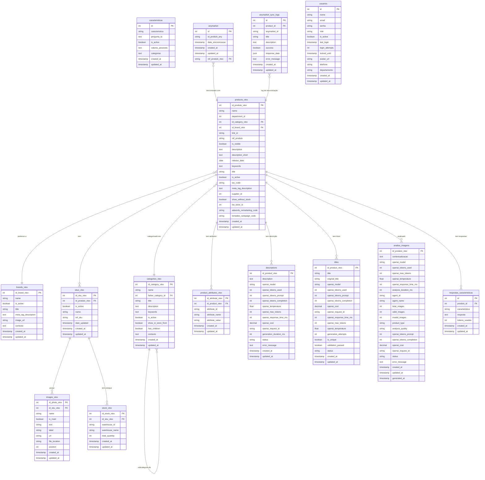

# Estrutura do Banco de Dados - Sistema VTEX

## Diagrama de Relacionamentos

## Resumo das Tabelas e Relacionamentos

### Tabelas Principais do Sistema VTEX

1. **products_vtex** - Tabela central que armazena todos os produtos
2. **brands_vtex** - Marcas dos produtos
3. **categories_vtex** - Categorias hierárquicas dos produtos
4. **skus_vtex** - SKUs (variações) dos produtos
5. **images_vtex** - Imagens dos SKUs
6. **stock_vtex** - Estoque por SKU e warehouse
7. **product_attributes_vtex** - Atributos específicos dos produtos

### Tabelas de IA e Geração de Conteúdo

8. **descriptions** - Descrições geradas por IA
9. **titles** - Títulos gerados por IA
10. **analise_imagens** - Análises de imagens por IA

### Tabelas de Características

11. **caracteristicas** - Características definidas para produtos
12. **respostas_caracteristicas** - Respostas geradas para características

### Tabelas de Integração e Sistema

13. **anymarket** - Sincronização com plataforma Anymarket
14. **anymarket_sync_logs** - Logs de sincronização com Anymarket
15. **usuarios** - Usuários do sistema

## Relacionamentos Principais

- **products_vtex** é a tabela central que se relaciona com:
  - brands_vtex (marca do produto)
  - categories_vtex (categoria do produto)
  - skus_vtex (variações do produto)
  - product_attributes_vtex (atributos específicos)
  - descriptions (descrições geradas)
  - titles (títulos gerados)
  - analise_imagens (análises de imagens)
  - respostas_caracteristicas (respostas de características)

- **skus_vtex** se relaciona com:
  - images_vtex (imagens do SKU)
  - stock_vtex (estoque do SKU)

- **categories_vtex** tem relacionamento hierárquico consigo mesma (father_category_id)

- **anymarket** se relaciona com products_vtex através do ref_produto_vtex
- **anymarket_sync_logs** se relaciona com products_vtex através do product_id

## Observações Importantes

1. **Chaves Primárias**: A maioria das tabelas usa IDs específicos do VTEX como chave primária
2. **Timestamps**: Todas as tabelas têm campos created_at e updated_at para auditoria
3. **Soft Delete**: Uso de campos is_active para desativação lógica
4. **IA Integration**: Múltiplas tabelas armazenam métricas de uso da OpenAI
5. **Hierarquia**: categories_vtex suporta estrutura hierárquica de categorias
6. **Integração**: Sistema preparado para sincronização com Anymarket
